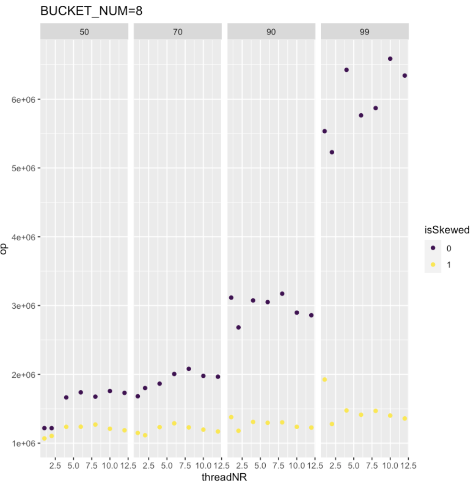
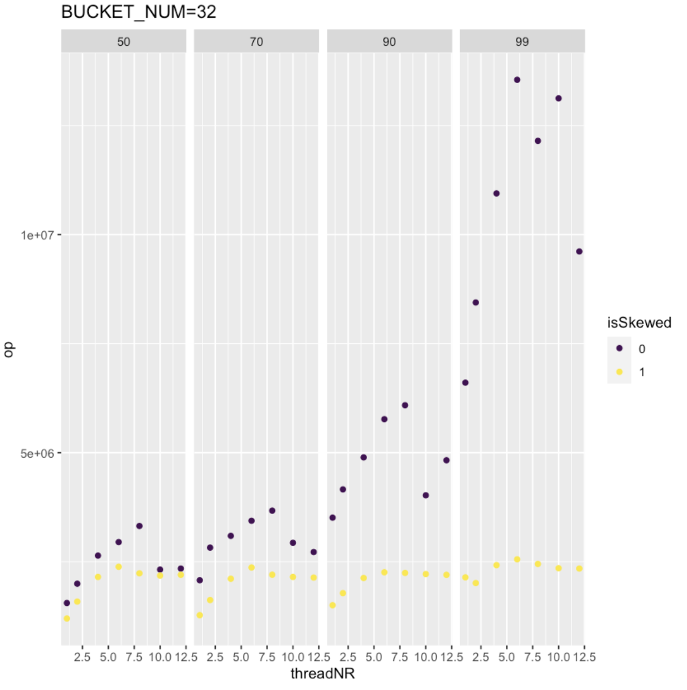

## 运行
在engine目录下
```
make
```

## KV设计

### 从`Bucket`说实现思路
`Bucket`是核心结构体. 每一个key, 根据它的首字符的ascii大小放入不同的桶中(原因是为了方便Range的实现). 每个桶, 有存key的文件(index文件)和value的文件(data文件), 在Open的时候, 会打开(或者创建)index文件和data文件, `key_fd`和`data_fd`保存着它们的文件描述符, 用于之后的读写和关闭文件.

其中每个key在index文件中的存在形式是: `<key的大小(in bytes)><key字符串><key对应的value在data文件中的位置的指针>`. 连续紧密存放. value在data文件中的存在形式是: `<value字符串>`, 连续紧密存放.

index文件的打开方式是mmap系统调用, 这是为了避免多次用read系统调用读入和用write系统调用写入, 类型是`MAP_SHARED`, 因为之后Write也会通过mmap写回文件. mmap返回的地址就存在`key_mmap`. `key_mmap_cur`的作用是, 由于Write的时候需要写入key文件, `key_mmap_cur`保存着下一次写入key应该写在内存中什么位置.

`data_offset`用于保存, 写入data文件时文件应该设置的偏移量.

`map`是key,value在内存中的存在形式. 它的value是`Location*`. Location有两个字段, 在data文件中的偏移量(offset)和长度(len). 之所以是Location指针, 是因为index文件存了Location, 在用mmap映射到内存后, 它已经存在于内存中了. 这样避免了对Location拷贝构造. Write需要写入index和data文件, 也需要写入`map`. Read从map中读取, 获得`Location*`后, 再根据Location用read系统调用, 读入value.

之所以map的value是`Location*`, 而不是value字符串本身. 是因为value比key大得多, 如果value是字符串会耗费太多的内存.


```
struct Bucket {
  std::map<std::string, Location*, std::less<>> map;
  i32 key_fd;
  i32 data_fd;
  u32 data_offset;
  u8* key_mmap;
  u8* key_mmap_cur;

  pthread_mutex_t lock;
};
```

在实现中, 桶数被设置为了32, 可以通过增加编译选项`-DBUCKET_NUM=8`进行调整.
key和value都

### Open
如果目录已存在, 对index文件进行mmap, 解析内容, 将key字符串和`Location*`存入map.

如果目录不存在, 对每个桶创建index文件和data文件, 对index文件进行mmap映射并清空, 之所以清空, 是因为解析index文件的判断解析结束的条件是看作为整数是否为0. 不清空会带来干扰.

### Write
判断应被分在哪一个桶. 先通过write系统调用写入data文件, 再通过mmap得到的内存写入index文件. 最后添加到map. 这个顺序是重要的. 需要先写入到data, 再写入到index文件. 如果反过来, 写入到index文件之后发生错误, data未被写入, 读取的时候就会发生错误. 反之不会, 因为有key, value的存在才有意义. 写map的顺序不很重要, 它与持久化无关, 放到最后是为了尽量先持久化. 用mmap写key的时候, 也需要注意原子性, key由3部分组成, 如果3部分分开memcpy, 如果在memcpy了第一部分后进程被杀死, 读入时也会导致错误. 

### Read
map中查找, 根据Location读文件.

### Range
由于桶是有序的, 比如第一个字符转u8后最小, 就会被分入第一个桶. map的key也是有序的, 因此用map的`lower_bound`方法即可.

### 如何保证线性一致性
对Read和Write, 在开始和结束的时候分别请求和释放需要的锁. 对Range, 对涉及的桶都上锁和释放锁. 由于每个线程上锁的顺序都一样, 因此不会导致死锁. 

实现中不能用读写锁(`pthread_rwlock`), 这是因为Read是用read系统调用的, 隐含着一个特殊的全局变量文件偏移, 如果用读写锁, 恰好在`lseek`之后被调度开(概率很小), 就很可能会导致错误. 

桶的存在提高了并发性.

### 如何保证崩溃一致性
只要操作系统不崩溃, write, `MAP_SHARED`的mmap都能保证写回. 即使进程被杀死, 在缓冲区中的文件也会被写回到存储设备. 但是不可通过libc写文件, 因为libc也有I/O缓冲区, 会导致同步性问题(除非手动刷).

在前面描述Write, 也提到了为了保证崩溃一致性的注意事项: 先写data再写index, 对index写要整体进行memcpy.

## 性能结果分析
详细数据见bench/result.csv. 在bench/result.R中读入了这个csv文件. 下面是桶数为12的图. 其中纵坐标是bench.cc得到的吞吐量(每秒进行的读或写的操作次数). 4幅子图对应的是不同的读比例, 分别为50%, 70%, 90%, 99%. 每幅子图的横坐标是线程数. isSkewed的情况对应不同颜色的点. 由于运行的平台有12个核, 因此线程数最大设为了12(1,2,4,6,8,10,12).



有这些结论:
- 吞吐量是百万数量级.
-  isSkewed=0时的吞吐量明显高于isSkewed=1的吞吐量. 并且读比例越高, isSkewed=0高得越多.
- 对于isSkewed=1的情况, 读比例增大, 吞吐量有提高, 但提高不明显. 对isSkewed=0, 读比例增大, 吞吐量的提升非常明显. 原因是Read比Write快很多.
- 线程数增加, 吞吐量是先增后减的趋势. 先增的原因是, 桶数有8. 后减的原因是, 桶数有限, 线程得排队, 调度切换线程的开销显著. 加速比最大都没有达到2, 说明并发性还是不佳, 推测如果提高桶数到几十, 在线程数12之内, 不会有下降趋势, 因此设置了`BUCKET_NUM`为32. 得到了下图的结果.


可以看到, 在线程数较多时, 吞吐量明显高于`BUCKET_NUM`为8的情况, 比如对于isSkewed=1的情况, 桶数为8, 吞吐量最大也未高于2e6, 桶数为32, 所有的读比例下, 吞吐量的最大值都高于2e6, 接近2.5e6. 并且随线程数增加, 加速比也有明显提升, 可以达到2以上. 不过, 无论读比例是多少, 仍是在线程数为6的时候吞吐量达到最大.

## 思考题1

### 进程崩溃
保证: 前面"如何保证崩溃一致性"提到了这个, 用write, mmap系统调用都可以, 不能用libc的写函数.

验证: crash_test测例是验证.

### 操作系统崩溃
用write和mmap不再能保证写回到存储设备. 可以用直写, 即open时flag加上`O_DIRECT`和`O_SYNC`再用write系统调用. 也可以用fsync同步. 也可以用mmap+msync同步. 并不是所有文件系统都支持直写(`O_DIRECT`). ext4支持, 但是ramdisk的tmpfs并不支持.

验证: 用虚拟机运行kv, 然后强制关闭虚拟机.

### 机器掉电
这种情况下, 我认为没有办法保证写回存储设备. 可以对index文件和data文件都加上校验位. 不读取有错误的数据.

验证: 断电.

